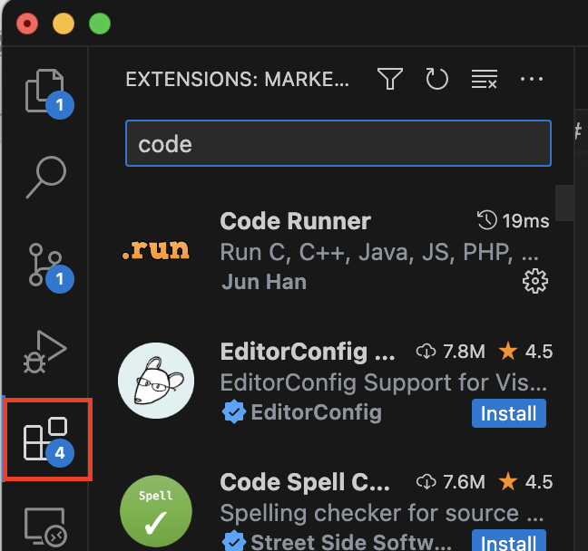
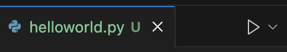
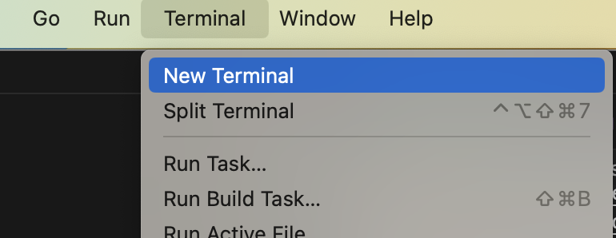

# 0.0 Hello World

[Back to chapter overview](../README.md)

[< back](../README.md) ---
[next >](1-python-files.md)

---

## Requirements

### Install python 3

Maybe you can skip this section so check if you already have python installed.

- Windows: Open Command Prompt
- Mac: Open Terminal

```bash
python --version
```

Make sure you have at least version 3.x on your system.

Check out [official documentation](https://www.python.org) and download [latest version](https://www.python.org/downloads/)

### Install VS Code

Download your favorite code editor, I recommend [VS Code](https://code.visualstudio.com) because you can use it for every projects with different languages.

In VS Code open the extensions menu on the left side to install the following extensions:

- [Python](https://marketplace.visualstudio.com/items?itemName=ms-python.python)
- [Code Runner](https://marketplace.visualstudio.com/items?itemName=formulahendry.code-runner) (optional)



## Hello World

It's time to write and run your first program: Hello World! Open your code editor, create a new file
`helloworld.py` and add the command:

```python
print("Hello World")
```

To execute this either click on the play button at the top:



or open a new terminal with the menu bar:



type `python helloworld.py` to see your output `Hello World`

easy :)

---

[Back to chapter overview](../README.md)

[< back](../README.md) ---
[next >](1-python-files.md)
