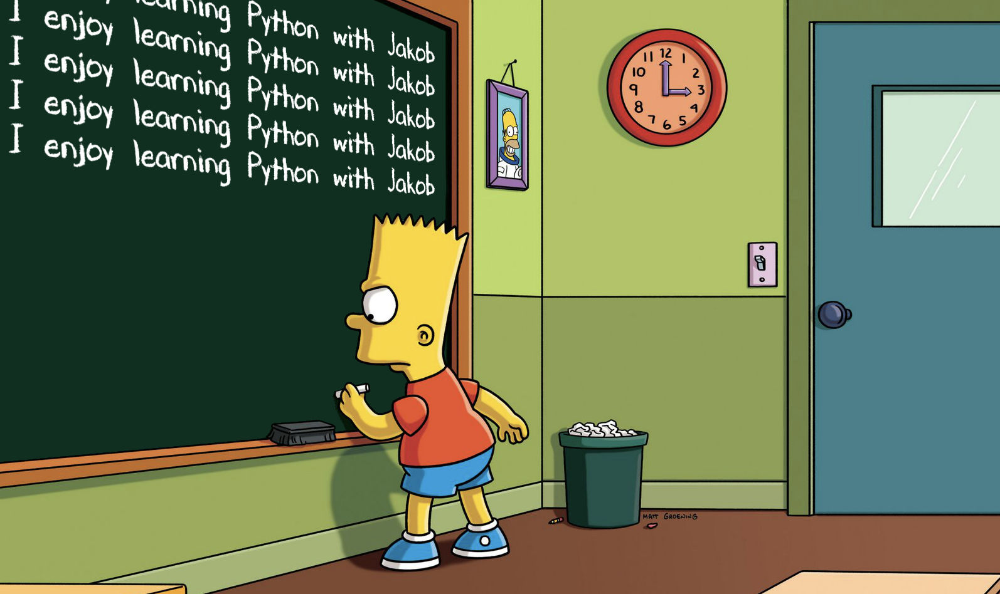

# 0.2 exercise

[Back to chapter overview](../../README.md)

[< back](exercise-1.md) ---
[next >](../../README.md)

---

### 1. In- & Output

Write a program which asks you for your name, age, 3 favorite movies, your python-skills from 0-10 and if you have pets. Store these user input values in variables with a matching data type and print out a summary.

_Note: you can parse a value to match or transform a value to a specific datatype_

```python
number_of_days_learning_python = "123" # string
int(number_of_days_learning_python) # int
float(number_of_days_learning_python) # float
```

### 2. Loops

Calculate the sum of each number from 1 to 100

### 3. Both

Write a program which expects the user to write
`I enjoy learning Python with Jakob`
to the console for 5 times. If there is any mistake print out an error message and start over new.
When the user completes this task, congratulate him and show the number of errors. Then you're done with this exercise :)



---

[Back to chapter overview](../../README.md)

[< back](exercise-1.md) ---
[next >](../../README.md)
